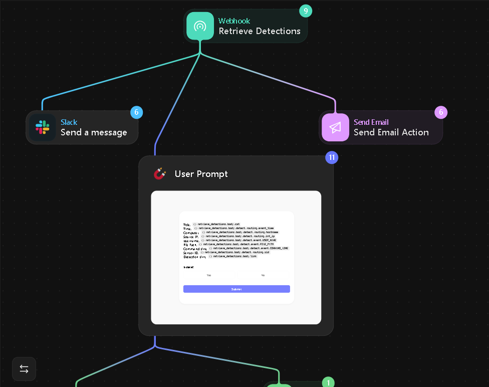
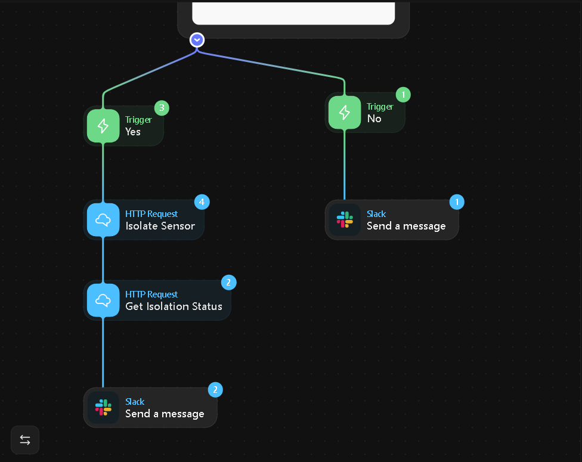

# SOAR–EDR Integration Project

This project demonstrates the integration of a SOAR platform (Tines) with an EDR solution (LimaCharlie) to automate incident detection and response. The lab environment was hosted on a Vultr virtual machine.  

## Overview

- Goal: Automate detection and response to endpoint threats  
- Tools Used:  
  - LimaCharlie (EDR)  
  - Tines (SOAR)  
  - Slack & Email (notifications)  
  - Vultr (virtual machine hosting)  
- Scenario: An attacker runs a credential-dumping tool (`lazagne.exe`) on a Windows endpoint.  
  - EDR detects malicious behavior  
  - SOAR ingests the alert and triggers a playbook  
  - Automated notifications and response actions are executed 
---

## Architecture

The SOAR–EDR architecture was designed and implemented inside **Tines**.  
Because the workflow is large, it is shown in two parts below.

### SOAR Workflow in Tines (Part 1) 
 
### SOAR Workflow in Tines (Part 2)
 

*Combined, these screenshots represent the full SOAR playbook structure inside Tines, which connects LimaCharlie detections with automated actions such as Slack and Email notifications.* --- 
## Workflow 
Steps 
1. [Endpoint Enrollment](img/01.png) 
2. [Attack Simulation](img/02.png)
3. [EDR Detection](img/03.png)
4. [Event Forwarding to SOAR](img/04.png)
5. [SOAR Playbook Trigger](img/05.png)
6. [Slack Notification](img/06.png)
7. [Email Notification](img/07.png)
8. [Response Action](img/08.png)
